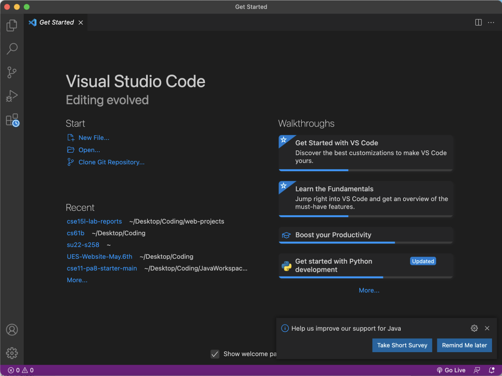
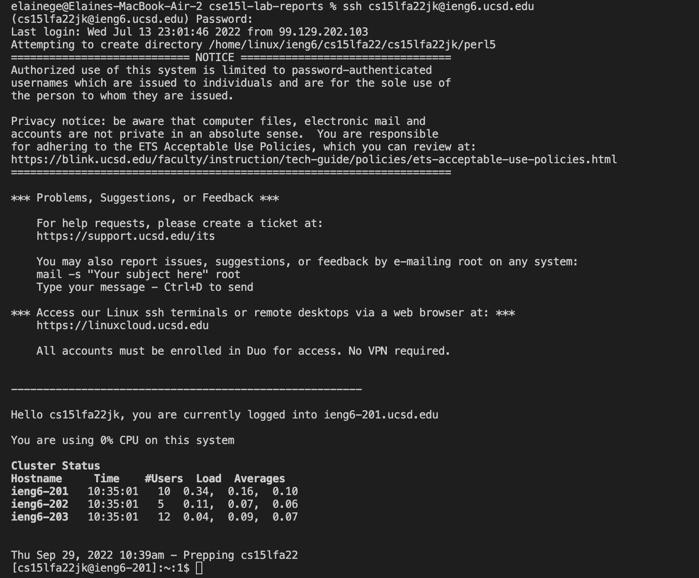
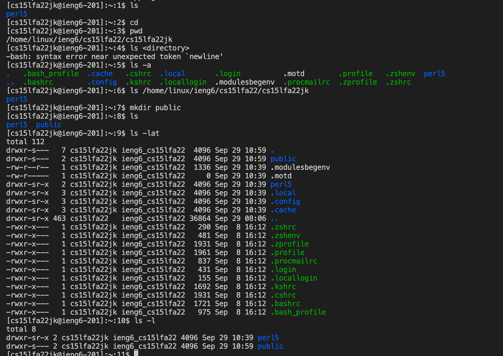
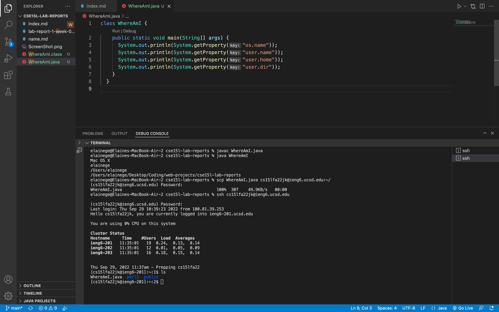
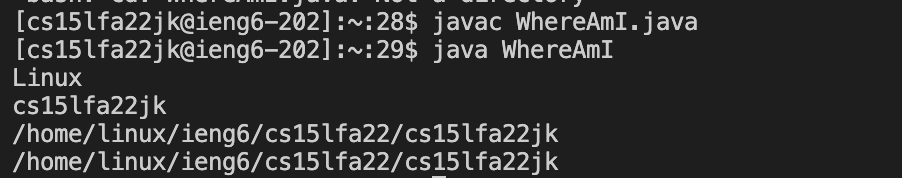
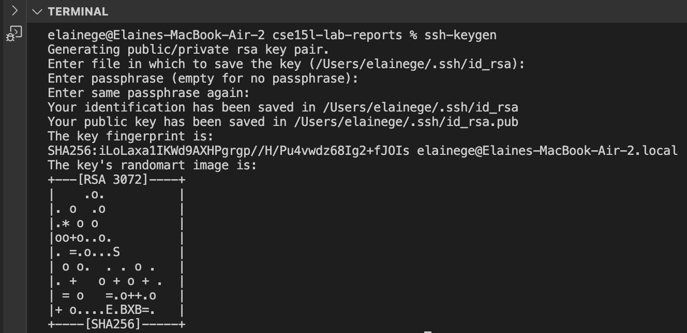
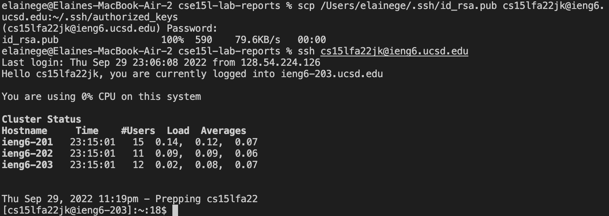
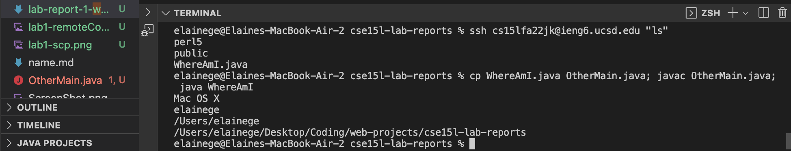

# Remote Access
> ## Installing VScode
* I have already downloaded Visual Studio Code in CSE 11. 
* The start page gives options to create new file, open recent, or clone git repository.



> ## Remotely Connecting
* After entering `$ ssh cs15lfa22jk@ieng6.ucsd.edu`, I enter my password of this account (which is invisible). Then, the terminal shows the CPU capacity and cluster status.
* After connecting to the server (the computer in CSE basement), I can run commands on the server using my laptop (the client).



> ## Trying Some Commands
* Many of the commands can be run both locally and remotely, such `cd ~`, `ls -lat`, etc.
* When I typed `ls -a` in the terminal, it lists all the files and directories including hidden ones that starts with .(filename)
* To log out of the remote server in the terminal, Ctrl-D or run the command `exit`



> ## Moving Files with `scp`

```
class WhereAmI {
  public static void main(String[] args) {
    System.out.println(System.getProperty("os.name"));
    System.out.println(System.getProperty("user.name"));
    System.out.println(System.getProperty("user.home"));
    System.out.println(System.getProperty("user.dir"));
  }
}
```
* Use the javac and java commands to compile and run the WhereAmI file.
* `scp` stands for secure copy, meaning that securely move files from the client to the server. 
* Run the command `scp WhereAmI.java cs15lfa22jk@ieng6.ucsd.edu:~/` and enter password for logging in.
* Log into ieng6 with ssh and use `ls` to see if the file now exist on the server or not. Then javac and java, we can see that it is in Linux, cs15lfa22jk.



> ## Setting an SSH Key


* ssh-keygen creates a pair of files called the public key and private key. 
* I copy the public key that was saved in `/Users/elainege/.ssh/id_rsa.pub` to a particular location (`.ssh/authorized_keys`) on the server, and the private key in a particular location on the client. Then, the ssh command can use the pair of files to replace typing password. 



* Once this is done, then we should be able to ssh or scp from this client to the server without entering your password.
* Common setup step in lots of work environments that involve code on a server.

> ## Optimizing Remote Running

* I combine commands in a line which can save keystrokes.
* I run command in quotes “ls” at the end of an ssh command which can directly run it on the remote server, log in, and list the home directory, then exit.

```
ssh cs15lfa22jk@ieng6.ucsd.edu "ls"
= ssh cs15lfa22jk@ieng6.ucsd.edu
ls

cp WhereAmI.java OtherMain.java; javac OtherMain.java; java WhereAmI
= cp WhereAmI.java OtherMain.java
javac OtherMain.java
java WhereAmI
```

