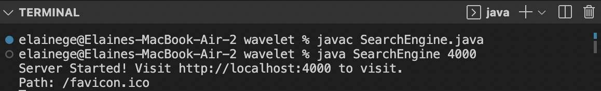

# Lab 3
## Part 1 Simplest Search Engine

* In SearchEngine.java, implement a web server that tracks a list of strings. It supports a path for adding a new string to the list, and a path for querying the list of strings and returning a list of all strings that have a given substring.

```
public class SearchEngine {
    
    public static void main(String[] args) throws IOException {
        if(args.length == 0){
            System.out.println("Missing port number! Try any number between 1024 to 49151");
            return;
        }

        int port = Integer.parseInt(args[0]);

        Server.start(port, new Handler());
    }
}

class Handler implements URLHandler {
    // The one bit of state on the server: a number that will be manipulated by various requests.

    List<String> result = new ArrayList<String>();

    public String handleRequest(URI url) {
        if (url.getPath().equals("/")) {
            return String.format("Hi, welcome to the web!");
        } else if (url.getPath().contains("/search")) {
            String temp = "";
                String[] parameters = url.getQuery().split("=");
                if (parameters[0].equals("s")) {
                    String substring = parameters[1];
                    
                    for (String eachstring : result) {
                        if(eachstring.contains(substring)){
                            temp += eachstring + " ";
                        }
                    }
                    return "Your search result is: " + temp;
                    //num += Integer.parseInt(parameters[1]);
                    //return String.format("Number increased by %s! It's now %d", parameters[1], num);
            }
            return temp;
        } else {
            System.out.println("Path: " + url.getPath());
            if (url.getPath().contains("/add")) {
                String[] parameters = url.getQuery().split("=");
                if (parameters[0].equals("s")) {
                    String temp = parameters[1];
                    result.add(temp);
                    return "You added the word: " + temp;
                    //num += Integer.parseInt(parameters[1]);
                    //return String.format("Number increased by %s! It's now %d", parameters[1], num);
                }
            }
            return "404 Not Found!";
        }
    }

}
```
### Building and Running the Server
By javac and java the command, we can build and run the server, and able to visit http://localhost:4000
The localhost domain refers to the computer you’re on. The 4000 above identifies a specific port that the web server runs on. 



My code is calling the method handleRequest under the class Handler. By calling `Server.start(port, new Handler())`, we are able to visit the web. The parameter that is passing in is url with the class URI. Since `(url.getPath().equals("/"))`, the screen prints the "Hi, welcome to the web!" as I set up. If those values change, the web will also change corresponding. The terminal prints `Path: /favicon.ico`. 
This site can’t be reached if the teriminal ends. 


My code is calling the method handleRequest under the class Handler. By calling `Server.start(port, new Handler())`, we are able to visit the web. The parameter that is passing in is url with the class URI. My url is `http://localhost:4000/add?s=pineapple` where `url.getPath().contains("/add")` and `(parameters[0].equals("s"))`. The varaible temp is equal to pineapple and add the word to `List<String> result`. The screen prints the "You added the word: pineapple". If those values change, the web will also change corresponding. The terminal prints `Path: /add Path: /favicon.ico` when using the add command. 


My code is calling the method handleRequest under the class Handler. By calling `Server.start(port, new Handler())`, we are able to visit the web. The parameter that is passing in is url with the class URI. My url is `http://localhost:4000/search?s=app` where `url.getPath().contains("/search")` and `(parameters[0].equals("s"))`. After adding three words and these three words are stored in varaible `List<String> result`. By looping thru, the varaible temp adds apple and pineapple. The screen prints the "Your search result is: apple pineapple ". If those values change, the web will also change corresponding. The terminal prints `Path: /favicon.ico` when using the add command. 


My code is calling the method handleRequest under the class Handler. By calling `Server.start(port, new Handler())`, we are able to visit the web. The parameter that is passing in is url with the class URI.My url is `http://localhost:4000/remove` where remove is not a word we look for. Since the path doesn't match what we are looking for, it will just return 404 not found. If those values change, the web will also change corresponding. The terminal prints `Path: /remove Path: /favicon.ico` when using the add command. 

## Part 2 Debugging 
### ArrayExamples 
```
@Test
  public void testReversed1() {
    int[] input1 = {1, 2, 3, 4};
    assertArrayEquals(new int[]{4, 3, 2, 1}, ArrayExamples.reversed(input1));
  }
  ```
  Orginial:
  ```
  static int[] reversed(int[] arr) {
    int[] newArray = new int[arr.length];
    for(int i = 0; i < arr.length; i += 1) {
        arr[i] = newArray[arr.length - i - 1];
    }
    return arr;
  ```
  Fixed: 
  ```
  static int[] reversed(int[] arr) {
    int[] newArray = new int[arr.length];
    for(int i = 0; i < arr.length; i += 1) {
      newArray[i] = arr[arr.length - i - 1];
    }
    return newArray;
  }

```
My failure-inducing input for Reverse is [1, 2, 3, 4]. I expected the result to be [4, 3, 2, 1]. The symptom is that the code produced 0 at index 0, instead of reversing the array and ouputting 4. Since int[] newArray = new int[arr.length], newArray is initialized to array of zeros with length same as the input array. The bug `arr[i] = newArray[arr.length - i - 1]` is that we assign the value of newArray which are all zeros to original array, resulting the output array as an array of all zeros. Since the symptom is that it prints 0 instead of any numbers that are actually in the input, it came to my attention to maybe wrongly assigning values. 


### ListExamples
```
@Test 
	public void testFilter1() {
        List<String> input1 = new ArrayList<>(3);
        input1.add("Hi");
        input1.add("ILoveYou");
        input1.add("Bye");
        List<String> result = new ArrayList<>();
        result.add("Hi");
        result.add("Bye");
        StringChecker sc = new myStringChecker();
        assertEquals(result, ListExamples.filter(input1, sc));;
	}
```
Originial:
```
 static List<String> filter(List<String> list, StringChecker sc) {
    List<String> result = new ArrayList<>();
    for(String s: list) {
      if(sc.checkString(s)) {
        result.add(0, s);
      }
    }
    return result;
  }
```
Fixed:
```
 static List<String> filter(List<String> list, StringChecker sc) {
    List<String> result = new ArrayList<>();
    for(String s: list) {
      if(sc.checkString(s)) {
        result.add(s);
      }
    }
    return result;
  }
```
The failure-inducing input (the code of the test) is ["Hi", "ILoveYou", "Bye"]. MyStringChecker filter for short words under length of 5. My expected output is <[Hi, Bye]>. The symptom (the failing test output) is at index 0 element[0] the expected is "Hi" but the actual is "Bye". The problem was that it added the chosen element at index 0, but it should have added it to the last index. I fixed it by using add(String s) instead of add(int index, String s) and it solves the issue. Looking from the incorrect output, we can see that the output is a word of our input, then we can take a look at the order and that seems to be the issue.  
